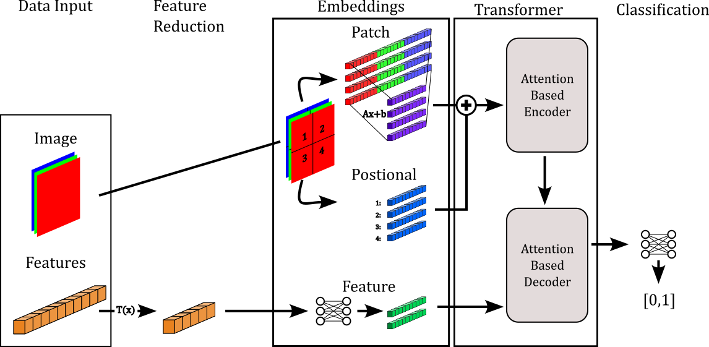

.. ISIC 2024 documentation master file, created by
   sphinx-quickstart on Wed Jul 31 23:13:54 2024.
   You can adapt this file completely to your liking, but it should at least
   contain the root `toctree` directive.

ISIC 2024
=======================

.. toctree::
   :maxdepth: 2
   :titlesonly:

   Competition Site <https://www.kaggle.com/competitions/isic-2024-challenge>
   plan/plan
   models/models
   notes/notes
   references

A challenge to develop image-based algorithms to identify histologically
confirmed skin cancer cases with single-lesion crops from 3D total body
photos (TBP). :cite:`isic-2024-challenge`

Latest
--------

Model version 1 - A transformer which makes use of both the images and features
provided in the ISIC dataset. It is coupled with unsupervised learning to reduce
the feature set to the most informative, then uses the features to query the 
image to gain a classification.

Read more :ref:`here<V1>`.

